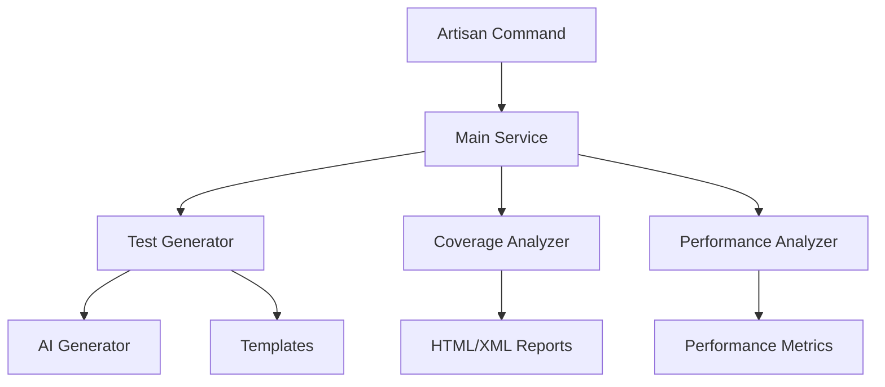

# Technical Documentation - Laravel Test Accelerator

## 📋 Table of Contents

1. [Architecture](#architecture)
2. [Installation and Configuration](#installation-and-configuration)
3. [API Reference](#api-reference)
4. [Artisan Commands](#artisan-commands)
5. [Services](#services)
6. [Templates and Stubs](#templates-and-stubs)
7. [AI Integration](#ai-integration)
8. [Testing and Quality](#testing-and-quality)
9. [Troubleshooting](#troubleshooting)
10. [Advanced Examples](#advanced-examples)

## 🏗️ Architecture

### Overview

Laravel Test Accelerator follows a modular architecture based on SOLID principles:

```
LaravelTestAccelerator/
├── Commands/           # Artisan Commands
│   ├── GenerateTestsCommand.php
│   ├── CoverageAnalysisCommand.php
│   └── PerformanceBenchmarkCommand.php
├── Services/           # Business Logic
│   ├── TestGenerator.php
│   ├── CoverageAnalyzer.php
│   ├── PerformanceAnalyzer.php
│   └── AITestGenerator.php
├── Facades/            # Laravel Facades
│   └── LaravelTestAccelerator.php
├── Resources/          # Templates and Views
│   └── stubs/
└── LaravelTestAcceleratorServiceProvider.php
```

### Data Flow



## ⚙️ Installation and Configuration

### Prerequisites

-   PHP 8.4+
-   Laravel 11.x or 12.x
-   Composer
-   PHP Extensions: `mbstring`, `xml`, `curl`

### Installation

```bash
composer require gessyken/laravel-test-accelerator
```

### Configuration

1. **Publish the configuration**:

    ```bash
    php artisan vendor:publish --tag="laravel-test-accelerator-config"
    ```

2. **Environment variables**:

    ```env
    TEST_ACCELERATOR_AI_PROVIDER=openai
    TEST_ACCELERATOR_AI_API_KEY=your_api_key
    TEST_ACCELERATOR_AI_MODEL=gpt-4
    ```

3. **Advanced configuration**:

    ```php
    // config/laravel-test-accelerator.php
    return [
        'ai_provider' => 'openai',
        'coverage' => [
            'threshold' => 80,
            'html_reports' => true,
        ],
        'benchmark' => [
            'slow_threshold' => 1000,
            'memory_threshold' => 1024,
        ],
    ];
    ```

## 🔧 API Reference

### LaravelTestAccelerator Facade

```php
use KENCODE\LaravelTestAccelerator\Facades\LaravelTestAccelerator;

// Generate tests
LaravelTestAccelerator::generateTests($path, $options);

// Analyze coverage
$coverage = LaravelTestAccelerator::analyzeCoverage($options);

// Performance benchmark
$stats = LaravelTestAccelerator::getPerformanceStats();

// AI generation
LaravelTestAccelerator::generateWithAI($path, $prompt);
```

### TestGenerator Service

```php
use KENCODE\LaravelTestAccelerator\Services\TestGenerator;

$generator = new TestGenerator();

// Basic generation
$generator->generateBasicTests($path);

// Model generation
$generator->generateForModel($modelPath);

// AI generation
$generator->generateWithAI($path, $prompt);
```

## 🎯 Artisan Commands

### test:generate

Generates tests for a file or directory.

```bash
# Basic generation
php artisan test:generate app/Models/User.php

# AI generation
php artisan test:generate app/Models/User.php --ai

# Directory generation
php artisan test:generate app/Services/

# Available options
php artisan test:generate --help
```

**Options**:

-   `--ai` : Use AI for generation
-   `--model` : Specify the model to use
-   `--template` : Use a custom template
-   `--force` : Overwrite existing files

### test:coverage

Analyzes code coverage.

```bash
# Basic analysis
php artisan test:coverage

# With HTML report
php artisan test:coverage --report

# With custom threshold
php artisan test:coverage --threshold=90

# Multiple formats
php artisan test:coverage --html --xml --clover
```

**Options**:

-   `--report` : Generate HTML report
-   `--threshold` : Set minimum threshold
-   `--html` : Generate HTML report
-   `--xml` : Generate XML report
-   `--clover` : Generate Clover report

### test:benchmark

Analyzes test performance.

```bash
# Complete benchmark
php artisan test:benchmark

# With custom thresholds
php artisan test:benchmark --slow-threshold=2000

# Memory analysis
php artisan test:benchmark --memory-analysis
```

## 🔧 Services

### TestGenerator

Main service for test generation.

```php
class TestGenerator
{
    public function generateBasicTests(string $path): bool
    public function generateForModel(string $modelPath): bool
    public function generateWithAI(string $path, string $prompt): bool
    public function generateForController(string $controllerPath): bool
    public function generateForService(string $servicePath): bool
}
```

### CoverageAnalyzer

Service for coverage analysis.

```php
class CoverageAnalyzer
{
    public function analyze(array $options = []): array
    public function generateHtmlReport(string $outputPath): bool
    public function generateXmlReport(string $outputPath): bool
    public function getCoverageStats(): array
}
```

### PerformanceAnalyzer

Service for performance analysis.

```php
class PerformanceAnalyzer
{
    public function analyze(array $options = []): array
    public function getSlowTests(): array
    public function getMemoryUsage(): array
    public function generateReport(): array
}
```

## 📝 Templates and Stubs

### Template Structure

```
resources/views/stubs/
├── unit-test.stub
├── feature-test.stub
├── model-test.stub
├── controller-test.stub
└── service-test.stub
```

### Available Variables

-   `{{CLASS}}` : Class name
-   `{{NAMESPACE}}` : Class namespace
-   `{{TEST_CLASS}}` : Test class name
-   `{{METHODS}}` : Class methods
-   `{{PROPERTIES}}` : Class properties

### Template Example

```php
<?php

namespace {{NAMESPACE}};

use Tests\TestCase;
use {{CLASS}};

class {{TEST_CLASS}} extends TestCase
{
    /** @test */
    public function it_can_be_instantiated()
    {
        $instance = new {{CLASS}}();
        $this->assertNotNull($instance);
    }

    {{METHODS}}
}
```

## 🤖 AI Integration

### Supported Providers

-   **OpenAI** : GPT-4, GPT-3.5-turbo
-   **Anthropic** : Claude-3-sonnet, Claude-3-haiku
-   **Google** : Gemini Pro

### Configuration

```php
// config/laravel-test-accelerator.php
'ai_provider' => 'openai',
'ai_api_key' => env('TEST_ACCELERATOR_AI_API_KEY'),
'ai_model' => 'gpt-4',
```

### Usage

```php
use KENCODE\LaravelTestAccelerator\Services\AITestGenerator;

$aiGenerator = new AITestGenerator();

// Generation with custom prompt
$tests = $aiGenerator->generate(
    'app/Models/User.php',
    'Generate comprehensive tests for this Eloquent model'
);

// Generation with context
$tests = $aiGenerator->generateWithContext(
    'app/Services/PaymentService.php',
    $contextData
);
```

## 🧪 Testing and Quality

### Running Tests

```bash
# Unit tests
composer test

# Tests with coverage
composer test-coverage

# Static analysis
composer analyse

# Code formatting
composer format
```

### PHPUnit Configuration

```xml
<!-- phpunit.xml.dist -->
<phpunit>
    <testsuites>
        <testsuite name="Laravel Test Accelerator">
            <directory>tests</directory>
        </testsuite>
    </testsuites>
    <coverage>
        <include>
            <directory suffix=".php">src</directory>
        </include>
    </coverage>
</phpunit>
```

### PHPStan Configuration

```neon
# phpstan.neon.dist
parameters:
    level: 5
    paths:
        - src
    checkOctaneCompatibility: true
    checkModelProperties: true
```

## 🔍 Troubleshooting

### Common Issues

#### 1. API Key Error

```
Error: Invalid API key
```

**Solution** : Check your API key in the `.env` file

#### 2. Tests Not Generated

```
No tests generated for path: app/Models/User.php
```

**Solutions**:

-   Verify the file exists
-   Check write permissions
-   Use the `--force` option

#### 3. Coverage Error

```
Coverage analysis failed
```

**Solutions**:

-   Install Xdebug or PCOV
-   Check PHPUnit configuration
-   Run `composer test-coverage`

### Logs and Debugging

```bash
# Enable detailed logs
php artisan test:generate --verbose

# Logs in storage/logs
tail -f storage/logs/laravel.log
```

## 📚 Advanced Examples

### Example 1: Test Generation for a Complex Model

```php
// app/Models/User.php
class User extends Authenticatable
{
    protected $fillable = ['name', 'email', 'password'];

    public function posts()
    {
        return $this->hasMany(Post::class);
    }

    public function getFullNameAttribute()
    {
        return $this->first_name . ' ' . $this->last_name;
    }

    public function isAdmin()
    {
        return $this->role === 'admin';
    }
}
```

**Command**:

```bash
php artisan test:generate app/Models/User.php --ai --model=gpt-4
```

**Result**:

```php
// tests/Unit/UserTest.php
class UserTest extends TestCase
{
    use RefreshDatabase;

    /** @test */
    public function it_can_create_a_user()
    {
        $user = User::factory()->create();
        $this->assertNotNull($user);
    }

    /** @test */
    public function it_can_get_full_name_attribute()
    {
        $user = User::factory()->create([
            'first_name' => 'John',
            'last_name' => 'Doe'
        ]);

        $this->assertEquals('John Doe', $user->full_name);
    }

    /** @test */
    public function it_has_many_posts()
    {
        $user = User::factory()->create();
        $post = Post::factory()->create(['user_id' => $user->id]);

        $this->assertTrue($user->posts->contains($post));
    }

    /** @test */
    public function it_can_check_if_user_is_admin()
    {
        $admin = User::factory()->create(['role' => 'admin']);
        $user = User::factory()->create(['role' => 'user']);

        $this->assertTrue($admin->isAdmin());
        $this->assertFalse($user->isAdmin());
    }
}
```

### Example 2: Advanced Coverage Analysis

```bash
# Analysis with high threshold
php artisan test:coverage --threshold=90 --html --xml

# Result
+------------------+----------+---------+
| File             | Coverage | Status  |
+------------------+----------+---------+
| app/Models/User  | 95%      | ✅ Good |
| app/Services/... | 67%      | ⚠️ Low  |
| app/Http/...     | 89%      | ✅ Good |
+------------------+----------+---------+

Overall coverage: 84%
Threshold: 90%
Status: ❌ Below threshold
```

### Example 3: CI/CD Integration

```yaml
# .github/workflows/tests.yml
name: Tests

on: [push, pull_request]

jobs:
    test:
        runs-on: ubuntu-latest

        steps:
            - uses: actions/checkout@v3

            - name: Setup PHP
              uses: shivammathur/setup-php@v2
              with:
                  php-version: "8.4"
                  extensions: mbstring, xml, curl, xdebug

            - name: Install dependencies
              run: composer install

            - name: Run tests
              run: composer test

            - name: Generate coverage
              run: php artisan test:coverage --html --threshold=80

            - name: Upload coverage
              uses: codecov/codecov-action@v3
```

---

This documentation is maintained up-to-date with each package version. For specific questions, consult the [GitHub Issues](https://github.com/gessyken/laravel-test-accelerator/issues) or contact the development team.

## 🌐 Website Documentation

For the most up-to-date documentation, visit our website: [https://accelerator.kencode.dev](https://accelerator.kencode.dev)
